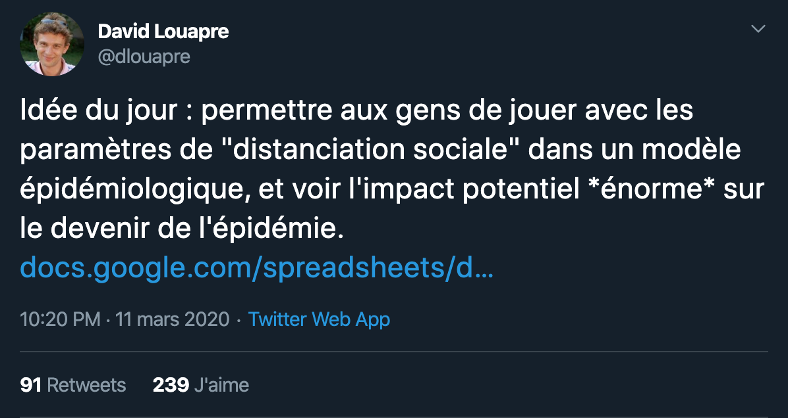

# Simulation de modèle épidémiologique
[](https://sciencetonnante-epidemie.netlify.com/)
[](./license)
[](https://twitter.com/\_YannBertrand)

**Stability: 1 - Experimental**

[](https://twitter.com/dlouapre/status/1237850901886296065)

> Modèle-jouet de développement d'épidémie en France suivant le modèle SIR.

**Voir [l'article de David Louapre](https://sciencetonnante.wordpress.com/2020/03/12/epidemie-nuage-radioactif-et-distanciation-sociale/) (sciencetonnante) qui a lancé l'idée.**

Le projet a depuis été partagé :
- [dans un billet de blog de David](https://scienceetonnante.com/2020/03/12/epidemie-nuage-radioactif-et-distanciation-sociale/)
- [dans une vidéo de DirtyBiology](https://youtu.be/bM7AOBxqjnE?t=726)

## Dev
### 🏗 Installation

```sh
yarn install
```

### 🚀 Usage

```sh
yarn start
```
